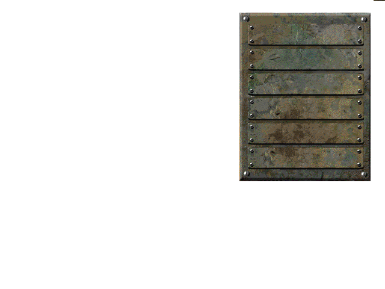
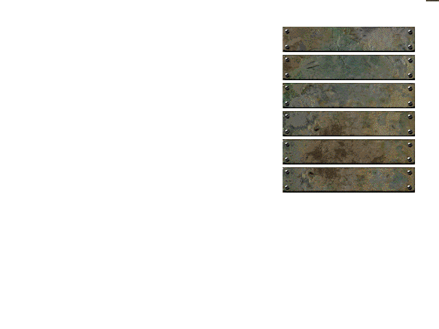
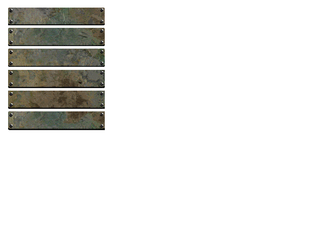

# Fallout Custom Main Menu Templates

.png template for making your own custom Fallout 2 main menu screens

To use:
- Download [`Fallout2_MainMenu_Template.png`](https://github.com/mrowrpurr/fallout-2-custom-main-menu/raw/main/Fallout2_MainMenu_Template.png)
- Use an image editor to create the menu you want (`640 x 480`)
  - Make sure to use the `.png` as an overlay so the buttons will appear correctly
- Save the image as a `.gif`
- Download and extract `editory.zip` ([forum post](https://www.nma-fallout.com/threads/frm-converter.220348/#post-4428264), [direct download link](http://madbrahmin.cz/download/fallout2/editors/editory.zip))
- Open a terminal in the folder where you have your new `.gif` and run the `gif2frm.exe` that comes with `editory.zip` to convert the image to a `.frm`
- Rename the `.frm` to `MAINMENU.frm`
- Create a folder in your Fallout 2 directory at this path: `[path to Fallout 2]\mods\MainMenu.dat\art\intrface`
- Place `MAINMENU.frm` into this folder
- Run the game!

> Note: due to the color palette which the game uses, your image may look like crap. Play around with it.  
> I don't know enough about the color palette yet to give you recommendations for Gimp/Photoshop on how to optimize for these colors.
